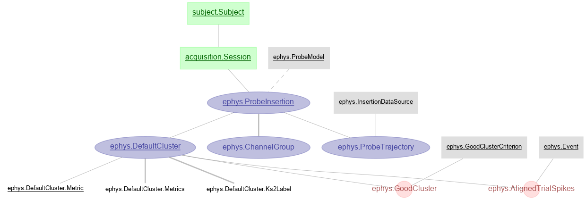
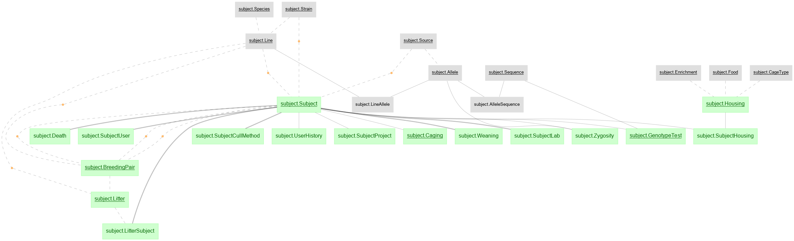
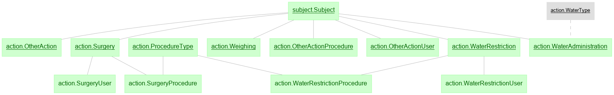
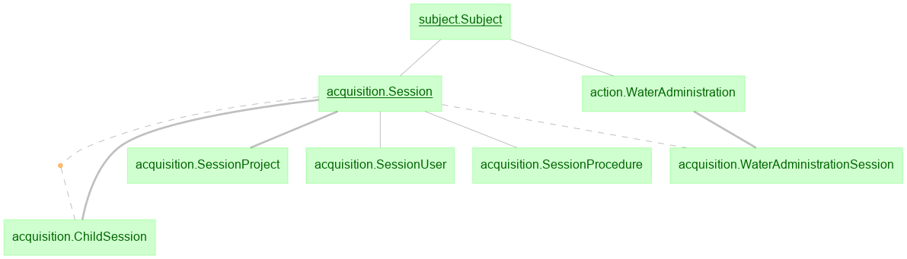
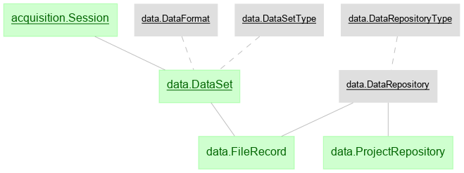
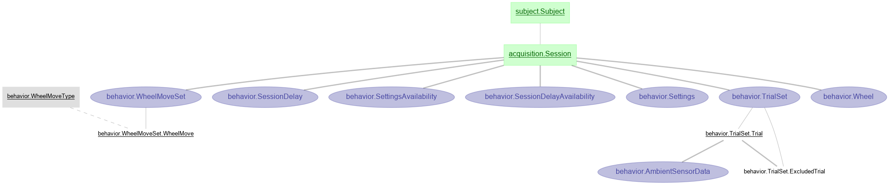
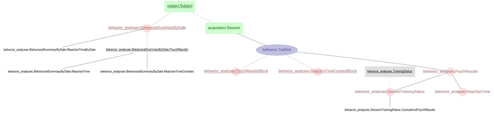
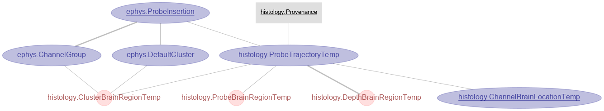
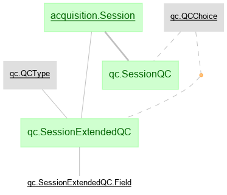

# Identify your role

This is important to identify how you would work with IBL-pipeline. There are two typical roles:

1. User:
>* Internal user: an IBL user who would like to utilize the IBL-pipeline to query the IBL database for research and create downstream tables for their own analyses in the IBL database, but a user will not contribute to the development of the main IBL pipeline.
>* External user: similar to an internal user, but an external user will not use IBL database to access data, but would like to adopt the database schemas and tables from IBL pipeline.

2. Developer: besides the actions of the users, a developer would like to contribute to the daily ingestion, computation, and plotting of the IBL-pipeline.


# Instruction for users

1. Get credentials to the database  server
> For an IBL internal user, contact Shan Shen via shanshen@vathes.com or Slack for a username and an initial password to the IBL database. You can change your password with
```
import datajoint as dj
dj.set_password()
```
> For an external user, set up your own database server and here is an [instruction](https://docs.datajoint.io/python/admin/1-hosting.html).

2. Install IBL-pipeline python package

> Install the package with pip, this gives the latest version. Use pip3 instead of pip does not work properly.

```
pip install ibl-pipeline
```
> To upgrade to the latest version,
```
pip install --upgrade ibl-pipeline
```
> After the installation, `datajoint` and `ibl_pipeline` could be imported as regular modules
3. Set up the configuration of DataJoint.
> Now you have successfully installed datajoint and ibl_pipeline package, to properly connect to the database server, set up the configuration by specifying dj.config.

```
shanshen@Shans-MacBook-Pro:~$ ipython
In [1]: import datajoint as dj

In [2]: dj.config
Out[2]:
{   'connection.charset': '',
    'connection.init_function': None,
    'database.host': 'localhost',
    'database.password': None,
    'database.port': 3306,
    'database.reconnect': True,
    'database.user': None,
    'display.limit': 12,
    'display.show_tuple_count': True,
    'display.width': 14,
    'fetch_format': 'array',
    'loglevel': 'INFO',
    'safemode': True}
```
> The default value of dj.config is shown as above. You will need to change the fields:
```
dj.config['database.host'] = 'datajoint.internationalbrainlab.org'
dj.config['database.user'] = 'YOUR_USERNAME'
dj.config['database.password'] = 'YOUR_PASSWORD'
```

> Then save the configuration as a json file with either dj.config.save_local(), or dj.config.save_global(). If saved globally, this configuration will be applied in all directories. If saved locally, it only applies when you under your current directory. The configuration will be saved as a json file dj_local_conf.json in the current directory. You don’t need to set up the configuration the next time.

> You can start using ibl_pipeline by importing modules, such as:

```
from ibl_pipeline import reference, subject, action, acquisition, data, behavior, ephys, histology
```

4. Special notes: the IBL-pipeline is under active development, the tables of interests may have already existed in the database before the latest version of ibl-pipeline is released. To get access to the latest tables, we also recommend using `dj.create_virtual_module`. The syntax to create a virtual module is as follows:
```
behavior = dj.create_virtual_module('behavior', 'ibl_behavior')
```

> Then `behavior` could be used to access any table:

```
behavior.TrialSet()
```

# Instruction for developers

1. Email shanshen@vathes.com for a database username and initial password.

2. Install Docker (https://www.docker.com/). Linux users also need to install Docker Compose separately. For Mac: https://docs.docker.com/docker-for-mac/.

3. Fork the repository (https://github.com/int-brain-lab/IBL-pipeline) onto your own GitHub account by clicking on the 'Fork' button in the top right corner of Github.

4. Clone the forked repository, i.e. copy the files to your local machine by `git clone git@github.com:YourUserName/IBL-pipeline.git`. Important: do *not* clone the repo from `int-brain-lab`, but the one that you forked onto your own account!

If you don't have SSH setup, use `git clone https://github.com/YourUserName/IBL-pipeline.git`. See https://help.github.com/articles/which-remote-url-should-i-use/ for an explanation of the distinction - in the long run, it's convenient to setup SSH authorization so you don't have to type passwords every time.

5. Create a file with the name `.env` (in your favourite text editor) in the cloned directory and **modify user and password values** per Step 1.

    File contents of ``.env``:
    ```
    DJ_HOST=datajoint.internationalbrainlab.org
    DJ_USER=username
    DJ_PASS=password
    ```

6. Now let's set up the docker container that have the entire environment.

> Copy `docker-compose-template.yml` as `docker-compose.yml` - this is your own file you can customize.

> Note: There is a similar file called `docker-compose-local_template.yml`. You will not need it unless you would like to perform ingestion from scratch in the database hosted on your own machine.

> There are two properties that you may want to customize.

> First, to save figures in a folder outside your `IBL-pipeline` docker folder (which is good practice so you don't clutter up the Github repo), you can tell Docker to create an alias older which points to your preferred place for storing figures.

	a. `open docker-compose.yml`

	b. add any folder you would like to access within the docker container in to the `volumes:`
    for example '~/Documents/ephys_data:/ephys_data'

	c. close the file

> Second, Set up your `.one_params`.

> If you have your `.one_params` in your root directory `~/.one_params`, you can directly go to Step 7. If you have your `.one_params` in another directory, please change the mapping `docker-compose.yml`
in the `volumes:` section `your-directory-to-one_params/.one_params: /root/.one_params`.

After your are done with these customization, you are ready to start the docker container, by running:
`docker-compose up -d`. You can check the status of the docker container by `docker ps`


Note: Anytime you would like to change the mapping from an outside folder to a directory inside docker container after you have your docker-compose running, please stop your docker container with the command 'docker-compose down', before you do the above steps.


## To run your own Python scripts ##

7. After running the docker container, you may want to use enter the container to run your own script. The command is `docker exec -it ibl-pipeline_datajoint_1 /bin/bash`. You would then enter the container with the current directory `/notebooks`. You can use `cd` to navigate inside the docker container.

> Note: If you would like to go to a specific folder, for example `prelim_analyses/behavioral_snapshots`at the same time when you run `docker exec`, you can use this command line: `docker exec -it docker exec -it ibl-pipeline_datajoint_1 bash -c "cd /src/IBL-pipeline/prelim_analyses/behavioral_snapshots; exec /bin/bash"`

8. To simplify the process of setting up the docker environment, we prepared a bash script `ibl_docker_setup-template.sh`. You may first want to copy this template by `cp ibl_docker_setup-template.sh ibl_docker_setup.sh`, then customize your own `ibl_docker_setup.sh`. In the file, you can change the directory you want to go to in the last line. The default command in the last line is: `docker exec -it docker exec -it ibl-pipeline_datajoint_1 bash -c "cd /src/IBL-pipeline/prelim_analyses/; exec /bin/bash"`, which goes to the folder `IBL-pipeline/prelim_analyses`. You can replace this directory with the directory you would like to go to.

After setting up this customized file `ibl_docker_setup.sh`, you can run this file to set up all your docker environment, by running `bash ibl_docker_setup.sh`


### Run your Python scripts after Docker is already installed for the first time ###

```
./ibl_docker_setup.sh
cd /src/ibl-pipeline/ibl_pipeline/analyses
python behavioral_snapshot.py
```

## To run example notebooks ##

9. Move into the cloned directory in a terminal, then run `docker-compose up -d`.

10. Go to http://localhost:8888/tree in your favorite browser to open Jupyter Notebook.

11. Open the directory `notebooks_tutorial` and feel free to go to through the tutorials.


### Staying up-to date ###

To stay up-to-date with the latest code from DataJoint, you might first want to check by `git remote -v`.
If there is no upstream pointing to the int-brain-lab repository, then do `git remote add upstream https://github.com/int-brain-lab/IBL-pipeline`.

Then `git pull upstream master` will make sure that your local fork stays up to date with the original repo.

#### Contributing code ####

If you feel happy with the changes you've made, you can add, commit and push them to your own branch. Then go to https://github.com/int-brain-lab/IBL-pipeline, click 'Pull requests', 'New pull request', 'compare across forks', and select your fork of `IBL-pipeline`. If there are no merge conflicts, you can click 'Create pull request', explain what changes/contributions you've made, and and submit it to the DataJoint team for approval.


# IBL pipeline schemas #

Schema of `reference`:


Schema of `subject`:


Schema of `action`:


Schema of `acquisition`:


Schema of `data`:


Schema of `behavior`


Schema of `behavior_analyses`:


Schema of `ephys`


Schema of `histology`:


Schema of `qc`:



